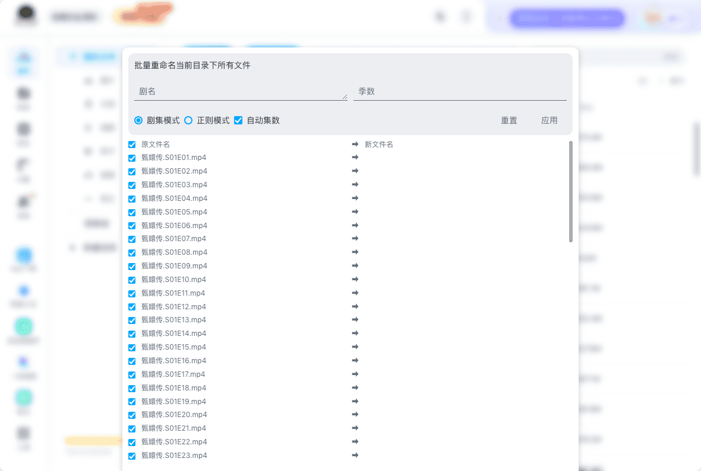
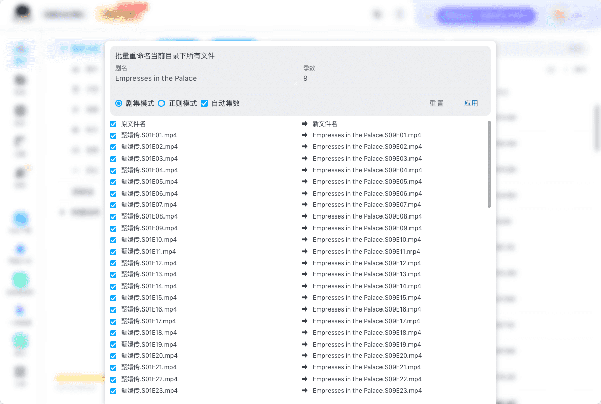
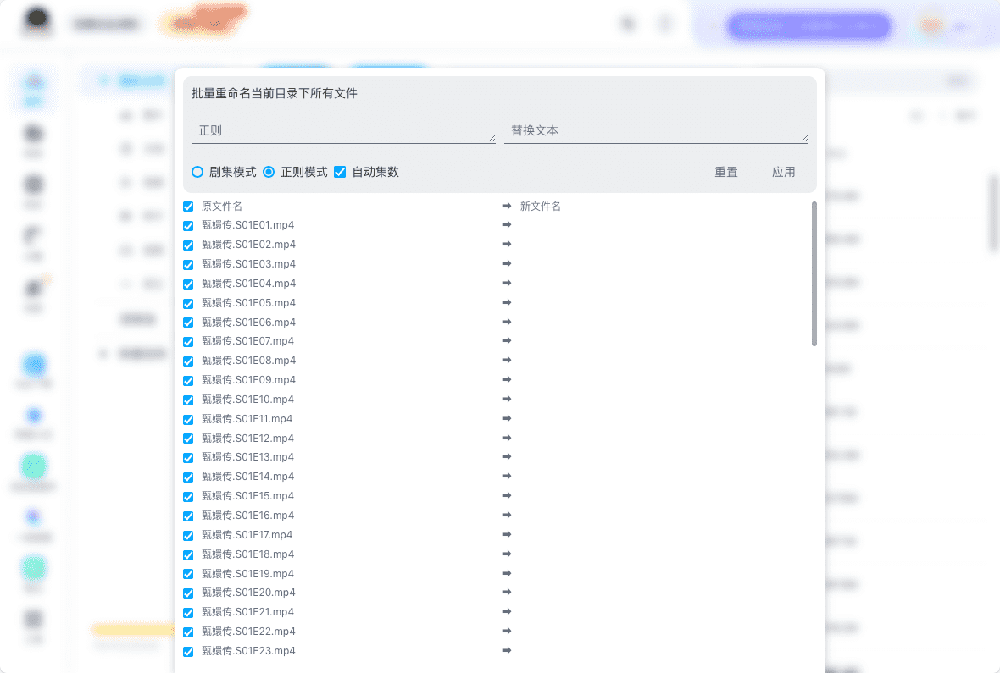
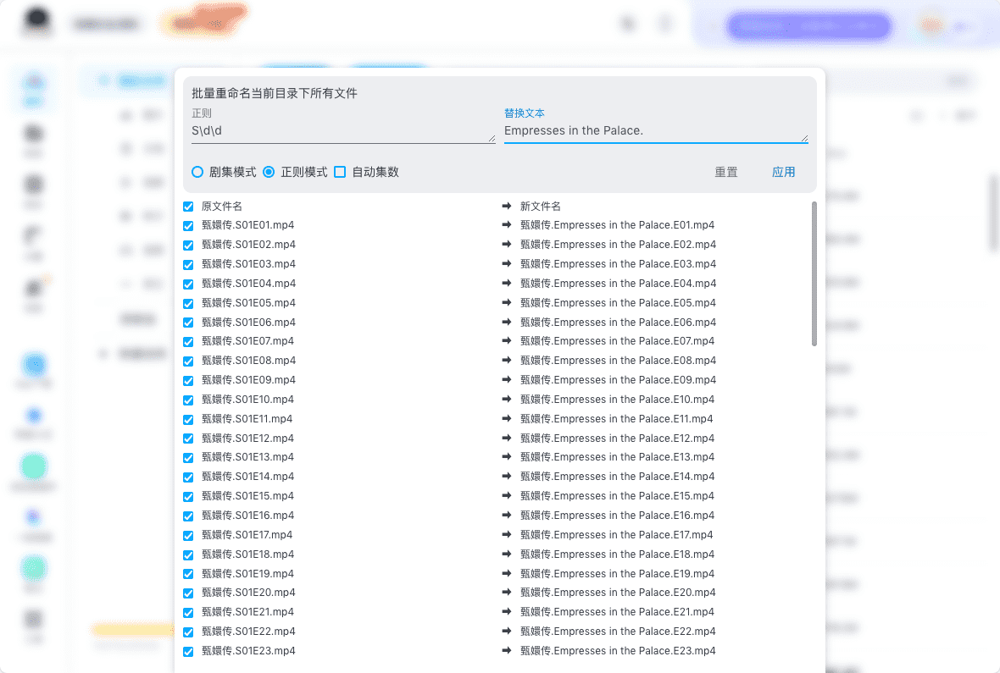
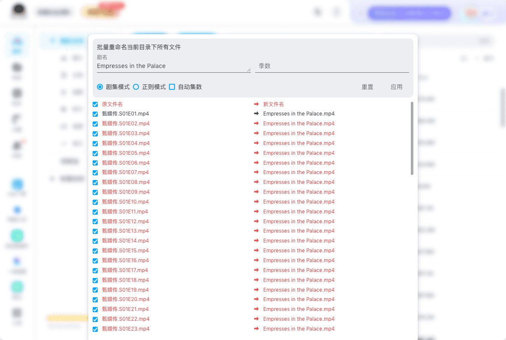
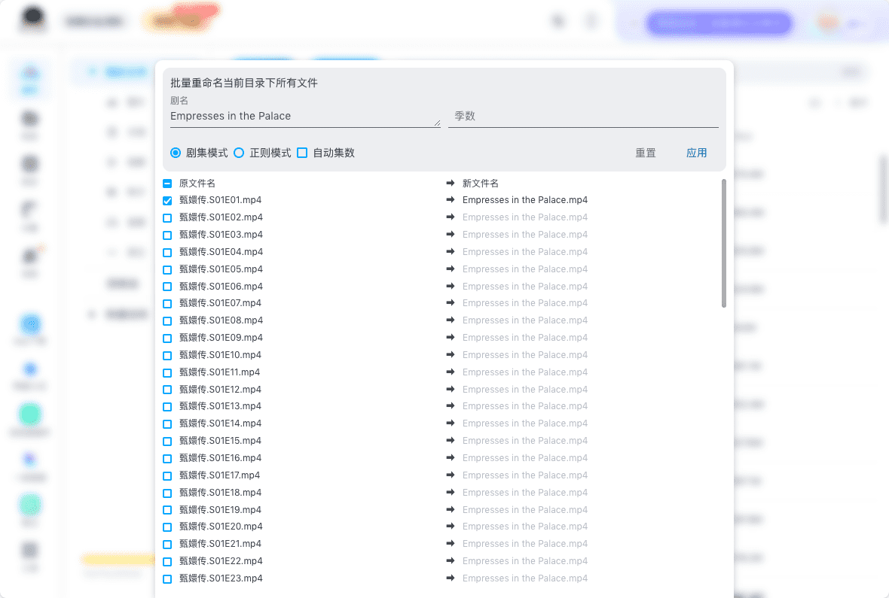

# 网盘文件批量重命名

## 功能介绍

批量重命名当前支持两种方式：剧集模式和正则模式

## 适用范围

- 🟢 百度网盘
- 🔴 阿里云盘
- 🔴 夸克云盘

百度网盘入口

## 使用方法

1. 打开重命名界面
2. 选择适用的替换模式
3. 输入替换规则的参数
4. 点击 **应用** 开始替换，等待替换完成

- 如未获取到文件列表数据，可点击 **重置**

### 剧集模式

剧集模式界面

- 输入剧名与季数
- 季数可不输入
- 建议勾选自动集数，将会按照排序自动补全集数

### 正则模式

正则模式界面

- 输入正则与替换文本
- 正则替换模式使用 Javascript 的 `String.prototype.replace` 方法，建议有正则基础的用户使用

### 错误提示

以下情况会出现错误提示

- 新文件名重复
- 新文件名为空

### 选择替换范围

